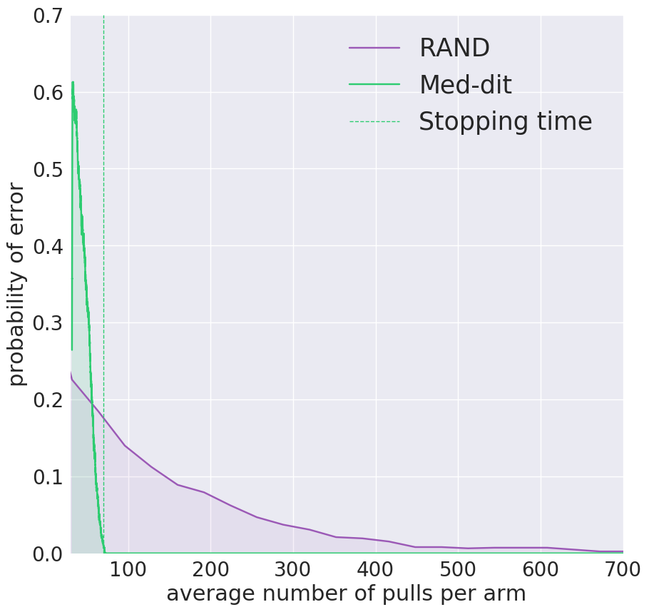

# Med-dit
## Finds the medoid of n points in O(nlog n) steps (naive approach takes O(n^2) steps).

This is a codebase to reproduce all the figures and numbers of the paper titled - "Medoids in Almost-Linear time via
multi-arm bandits".

 1) All the figures can be viewed and generated via ipython notebooks in 'figure' folder
 2) The above figures are generated from experiments - stored in 'experiments' folder
 3) The stored experiments can be re-generated using the following four lines of code

  * python algorithm.py --dataset rnaseq20k --num_exp 1000 --num_jobs 32 --verbose False
  * python algorithm.py --dataset rnaseq100k --num_exp 1000 --num_jobs 32 --verbose False
  * python algorithm.py --dataset netflix20k --num_exp 1000 --num_jobs 32 --verbose False
  * python algorithm.py --dataset netflix100k --num_exp 1000 --num_jobs 32 --verbose False

    * dataset - name of the dataset
    * num_exp - Number of total experiments
    * num_jobs - Number of experiments run parallely
    
## Performance on Real Data

The performance of Med-dit on the 109k cluster of the single cell 
RNA-seq dataset of [10x-genomics](https://support.10xgenomics.com/single-cell-gene-expression/datasets/1.3.0/1M_neurons)
is shown below. We compare the performance with [RAND](https://www.emis.de/journals/JGAA/accepted/2004/EppsteinWang2004.8.1.pdf),
which is the only published algorithm we know of that can be made to work at
such scale of data. The comparision is by computing the probability
of getting the medoid wrong after any number of pulls. We note that
unlike RAND, med-dit has a stopping time (the average number of
distance evaluations per arm at this are
indicated with the vertical line). 

  
